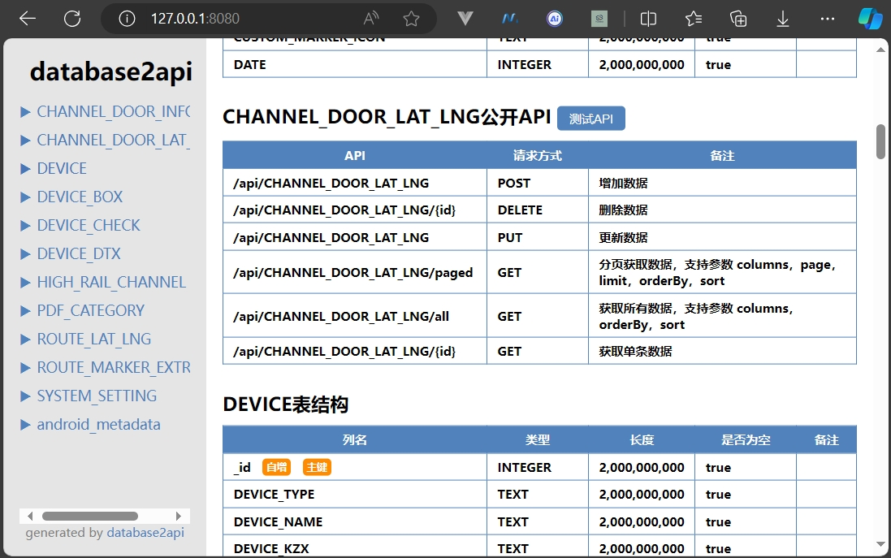
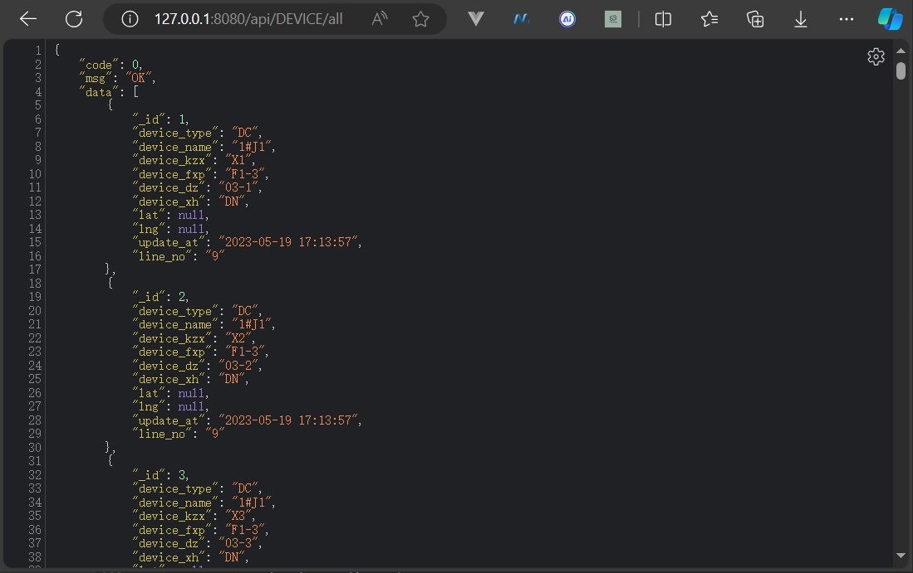
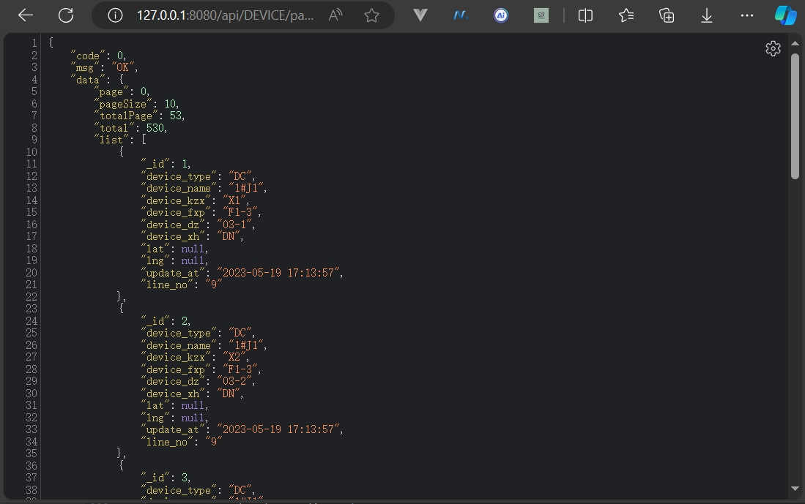
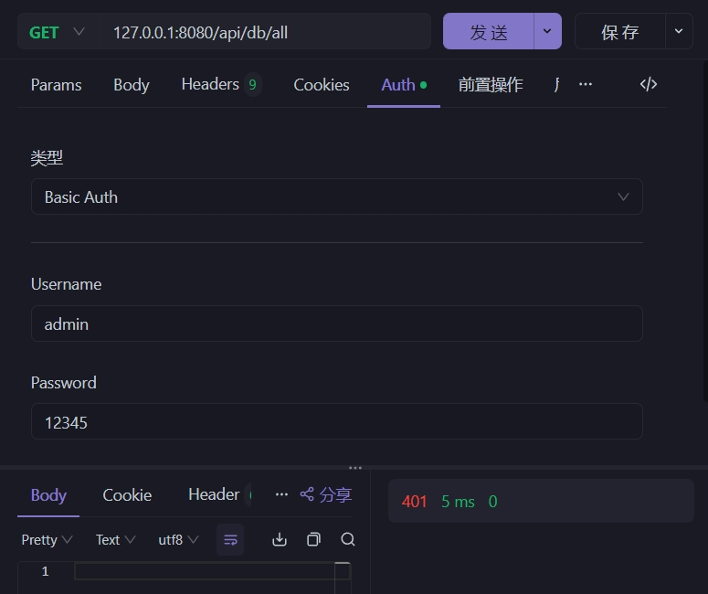
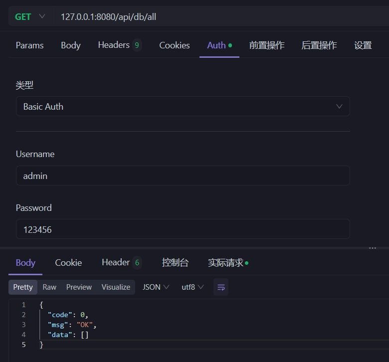
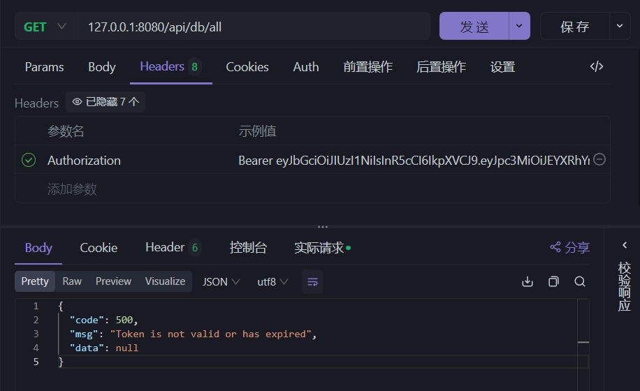
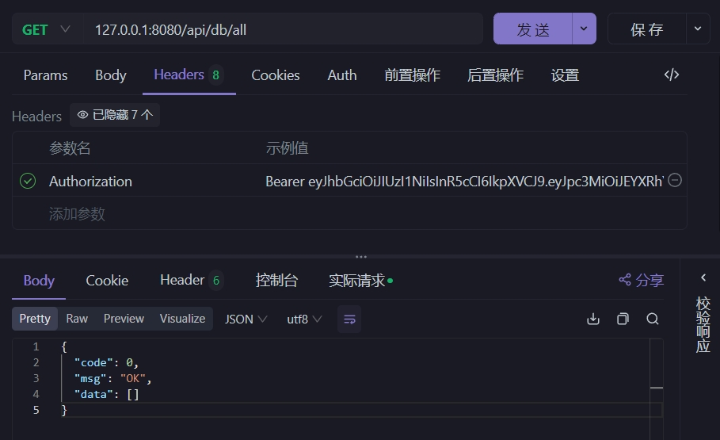
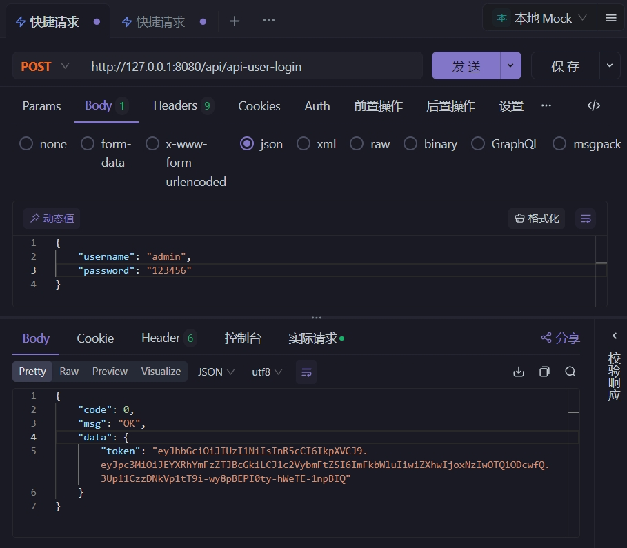
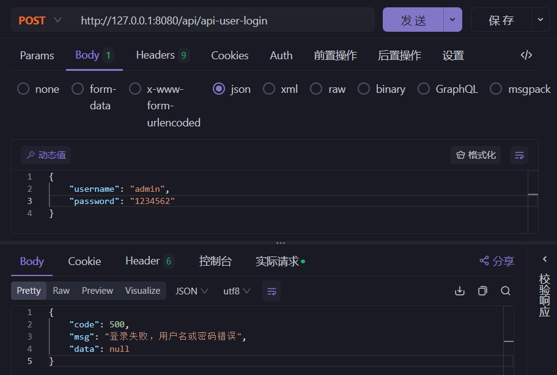

# database2api
**database2api** means `DataBase to API`, use database, generate open `API`.

**database2api** is a powerful and convenient tool. Its main function is to automatically generate open `API` interfaces based on the existing database, which can significantly save time and energy for developers. It is especially suitable for scenarios where there is an existing database and an `API` interface needs to be provided, or where only the database is built and the `API` interface needs to be implemented quickly.

## RELEASE ✈️
- 0.0.2 `2024-7-18` First Released Version
- 0.0.3 `2024-7-20` Add `Bearer` Authentication

## I. Function Introduction ⚡
**database2api** can intelligently parse the database structure and automatically generate the corresponding `API` interfaces according to the user's requirements and configuration. It enables you to easily achieve the interaction between the database and external applications without the cumbersome manual coding.

In today's software development, the interaction between the database and external applications is a crucial link. However, manually writing `API` interfaces is often a time-consuming and error-prone task, and it requires proficiency in a certain backend programming language, with a relatively high threshold. The development of **database2api** aims to solve this pain point, allowing developers to focus more on the implementation of business logic rather than spending excessive time and effort on interface development.

For example, in a rapidly evolving project, the database structure may change frequently. Using **database2api**, you only need to update the configuration file to quickly regenerate the API interfaces adapted to the new structure, greatly improving the agility of the project.

Whether you are an individual developer or a team, **database2api** will be your powerful assistant to enhance development efficiency and accelerate the project process. 

## II. Technical Principle 💛
This tool uses [Ktor](https://ktor.io/) as the underlying framework and `JDBC` as the database access layer. It obtains the database structure through `java.sql.DatabaseMetaData`, and then dynamically registers the `API` routes through `Ktor` to realize the generation of `API` interfaces directly from the database. 

## III. Supported Databases
Currently, **database2api** supports the following mainstream databases:
- ✅ Sqlite
- ✅ MySQL
- ✅ Postgresql
- ✅ Microsoft SQL Server
- ✅ MariaDb

## IV. Advantages
1. **Efficient and convenient**: Through a simple configuration file, the required API interfaces can be quickly generated, greatly improving the development efficiency.
2. **Widespread database support**: Covers common database types to meet the needs of different projects.
3. **Easy to maintain**: The generated interface structure is clear, the code is standardized, and it is convenient for subsequent expansion and testing.

## V. How to use
- [Click to download](https://github.com/mrhuo/database2api/raw/main/release/database2api.jar) or directly clone the repository and compile it into a `jar`, the file name is `database2api.jar`.
- Preview of the directory structure
```text
│  database2api.jar  <-- Main program (required)
└─ data
     └─ ext          <-- Directory for placing extended APIs (optional)
     └─ web          <-- Directory for static files (optional)
     └─ setting.ini  <-- Configuration file (required)
```
- Sample configuration file `setting.ini`
```text
# Default port for API
API_PORT=8080
# Prefix for generating API, if set to api/v1, then the API becomes: http://localhost:{PORT}/api/v1/xxxxxx
API_PREFIX=api
# Whether to enable API documentation, address http://localhost:{PORT}, if set to false, no API documentation will be generated
API_INDEX_ENABLED=true
# Whether to enable the interface authorization access function, default is false, and all APIs can be accessed without authorization and authentication
API_AUTH_ENABLED=false
# Interface authorization access, supports: Basic, JWT, Bearer. (Other authorization and authentication methods may be supported in the future)
API_AUTH_TYPE=JWT
# List of user names and passwords allowed to access the interface
API_AUTH_USERS=admin:123456,user:1234
# When Bearer authorization is used, it should be configured as [tag:token], where tag represents the attribution of this token, and tag can be empty (the colon cannot be omitted).
# API_AUTH_USERS=CompanyA:123,CompanyB:456,:789
# Default connection address of the database (mainly the database connection string here is required, and samples of other database connection strings are below)
DB_URL=jdbc:sqlite://G:/database2api-test/sqlite/fqb.db
# Database user name
DB_USER=
# Database password
DB_PWD=
# Table names for generating API, if empty, all tables will generate API, multiple tables are separated by commas
INCLUDE_TABLES=
# Table names that need to be ignored, if not empty, the specified table names will be filtered, multiple tables are separated by commas
IGNORED_TABLES=
# Whether to enable the static website, if enabled, a web directory will be created, and static resources can be accessed by putting them in
STATIC_WEB_ENABLED=true
# Whether to enable extended API, allowing users to use JS code to query the database with custom SQL
EXT_API_ENABLED=true
```

- Startup method:
```shell
java -jar database2api.jar
```

After startup, the console log is as follows:

```text
2024-07-11 23:43:14.367 [main] DEBUG cn.hutool.log.LogFactory - Use [Slf4j] Logger As Default.
2024-07-11 23:43:14.369 [main] INFO  com.mrhuo.Database2Api - Database2Api: 开始初始化
2024-07-11 23:43:14.382 [main] INFO  com.mrhuo.Database2Api - Database2Api: 开始初始化 API 配置
2024-07-11 23:43:14.431 [main] DEBUG cn.hutool.setting.SettingLoader - Load setting file [D:\work\java\database2api\data\setting.ini]
2024-07-11 23:43:14.444 [main] INFO  com.mrhuo.Database2Api - Database2Api: 静态网站主页[http://127.0.0.1:8080/web/index.html]
2024-07-11 23:43:14.444 [main] INFO  com.mrhuo.Database2Api - Database2Api: 开始初始化数据库
2024-07-11 23:43:14.444 [main] INFO  com.mrhuo.Database2Api - Database2Api: 使用链接字符串[jdbc:sqlite://G:/database2api-test/sqlite/fqb.db]
2024-07-11 23:43:15.236 [main] INFO  com.mrhuo.Database2Api - Database2Api: 获取到所有数据表的表结构
2024-07-11 23:43:15.236 [main] INFO  com.mrhuo.Database2Api - Database2Api: 已保存到文件[D:\work\java\database2api\data\tables.json]
2024-07-11 23:43:15.236 [main] INFO  com.mrhuo.Database2Api - Database2Api: 初始化全部成功
2024-07-11 23:43:15.383 [main] INFO  ktor.application - Autoreload is disabled because the development mode is off.
2024-07-11 23:43:16.241 [main] INFO  ktor.application - Application started in 0.928 seconds.
2024-07-11 23:43:16.242 [main] INFO  ktor.application - Application started: io.ktor.server.application.Application@299266e2
2024-07-11 23:43:16.633 [DefaultDispatcher-worker-1] INFO  ktor.application - Responding at http://127.0.0.1:8080
```

After successful startup, the directory structure becomes:

```text
│  database2api.jar
└─ data
     │  setting.ini
     │  tables.json      <-- This is the name of all tables in the database, and it will not be retrieved from the database again on the next startup, and this file will be used directly. If the database has been updated, delete this file.
     │  table_names.json <-- This is the structure of all tables in the database, and it will not be retrieved from the database again on the next startup, and this file will be used directly. If the database has been updated, delete this file.
     └─ ext              <-- Directory for placing extended APIs (optional)
     └─ web              <-- Directory for static files (optional)
         └─ index.html   <-- This is the default homepage of the static webpage.
```

Open the browser and visit [http://127.0.0.1:8080](http://127.0.0.1:8080). If the configuration `API_INDEX_ENABLED=true` is enabled, the interface will be as follows at this time:

> The port setting can be found in the configuration file `API_PORT=8080`<br/>
> If `API_INDEX_ENABLED=false` is set, the `API` documentation interface will not be displayed.



Find a test to get all data at will: `http://127.0.0.1:8080/api/DEVICE/all`

> Here, `DEVICE` is the table name in the database



Test paged data display again: http://127.0.0.1:8080/api/DEVICE/paged



It can be seen that just by configuring the database link, a complete and usable API interface is automatically generated, which is very convenient.

## VI. Interface Security

Two authorization and authentication methods, Basic and JWT, are now supported, and the configuration is as follows:

```text
# Whether to enable the interface authorization access function
API_AUTH_ENABLED=false
# Interface authorization access, supports: Basic, JWT,
API_AUTH_TYPE=JWT
# List of user names and passwords allowed to access the interface
API_AUTH_USERS=admin:123456,user:1234
```

#### Basic Authorization

- You need to configure `API_AUTH_ENABLED=true` to enable API authorization
- You need to configure `API_AUTH_TYPE=Basic` (note the case)
- You need to configure `API_AUTH_USERS=user:pass,user1:pass1` to set the allowed user password pairs

> Basic authorization failure demo



> Basic authorization success demo



#### JWT Authorization

- You need to configure `API_AUTH_ENABLED=true` to enable API authorization
- You need to configure `API_AUTH_TYPE=JWT` (note the case)
- You need to configure `API_AUTH_USERS=user:pass,user1:pass1` to set the allowed user password pairs

Note that for JWT authorization, a separate user login interface is provided, and the path is `/api/api-user-login`. The `api` prefix in the front is set by the configuration `API_PREFIX`.

> JWT verification failure demo



> JWT verification success demo



> JWT user login success demo



> JWT user login failure demo



## VII. Advanced Content

#### Extended API

Extended API, simply put, is to write a JS file as an API extension interface, perform database access, and complete the function of API requests.

To enable it, set `EXT_API_ENABLED=true` in the configuration file, create an `ext` directory under the `data` directory, and create the file `get_hello.js` with the following content:

> Note: The file name format is {get|post}_{api_name}.js

```js
function main() {
    var name = context.query.name || "no name";
    return "hello " + name;
}
```

Specify the function name `main`. After restarting **database2api**, you can see the console prompt:

```text
2024-07-14 17:26:58.380 [main] INFO  com.mrhuo.plugins.RoutingKt - Database2Api.scriptApiRoute: Successfully created extended API [GET:/api/ext/hello]
```

When accessing this API [http://127.0.0.1:8080/api/ext/hello?name=mrhuo](http://127.0.0.1:8080/api/ext/hello?name=mrhuo), the returned result is as follows:

```json
{
  "code": 0,
  "msg": "OK",
  "data": "hello mrhuo"
}
```

**Note**: Because extended APIs use a scripting engine to interpret and execute script code, the performance is not very good. If not necessary, please do not rely too much on this feature.

Currently, two objects, `db` and `context`, are supported in the extended API.

- The `db` object is mainly used for database queries, providing three methods: `db.query(sql)`, `db.queryOne(sql)`, and `db.exec(sql)`.
- The `context` object is mainly used to obtain the current request parameters, providing five objects: `context.uri`, `context.method`, `context.headers`, `context.query`, and `context.body`.

## Appendix 1: Database connection string templates

*Note that if the database has a password, you also need to configure `DB_USER` and `DB_PWD`*

1. Sqlite

```text
DB_URL=jdbc:sqlite://G:/db.db
```

2. MySQL

```text
DB_URL=jdbc:mysql://127.0.0.1:3306/db?useSSL=false&serverTimezone=UTC&charset=utf8mb
```

3. PostgreSQL

```text
DB_URL=jdbc:postgresql://127.0.0.1:5432/db
```

4. Microsoft SQL Server

```text
DB_URL=jdbc:sqlserver://;serverName=rm-abc.sqlserver.rds.aliyuncs.com;port=1433;databaseName=db_cms
```

5. MariaDb

```text
jdbc:mariadb://127.0.0.1:3306/mysql?useSSL=false&serverTimezone=UTC&charset=utf8mb4
```

## Appendix 2: Open source address

```text
https://github.com/mrhuo/database2api
```

#### Copyright notice

MIT
