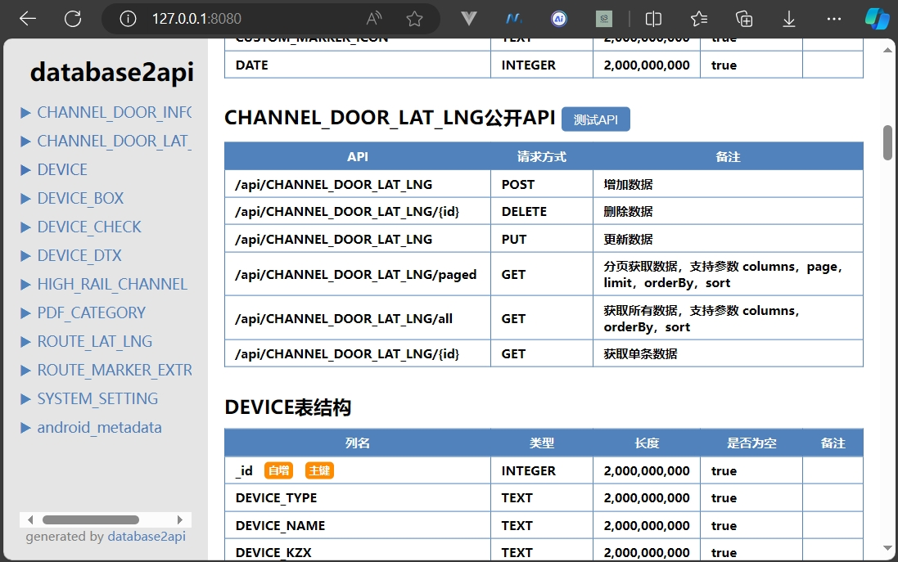
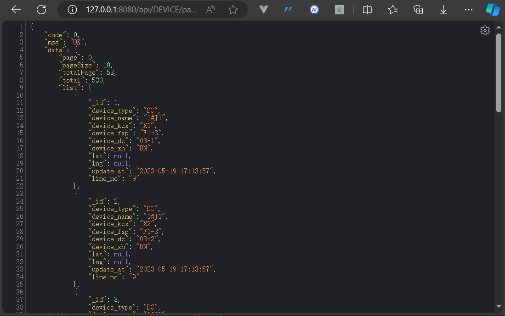
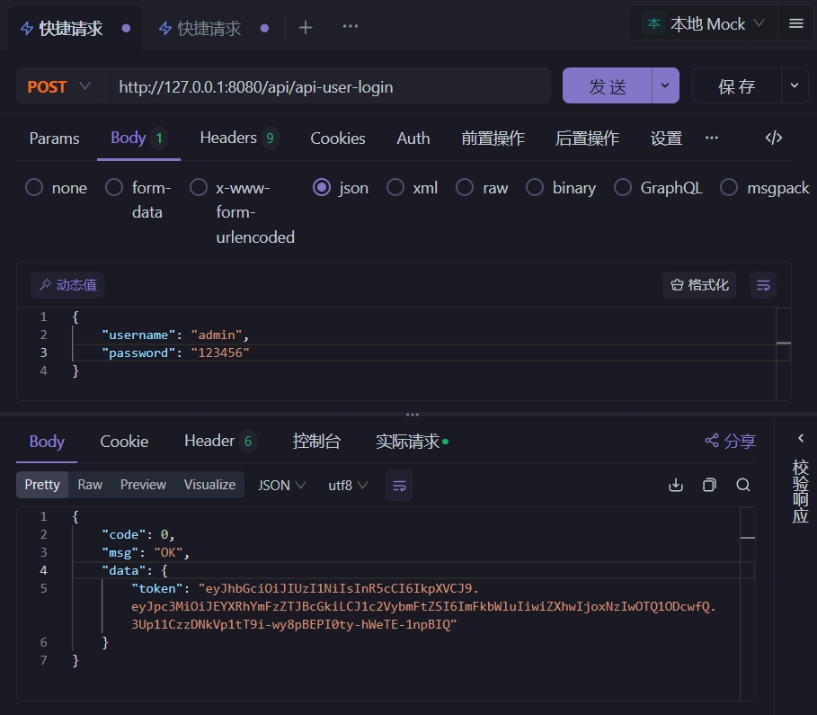

# database2api
**database2api** 意为 `DataBase to API`，即只要有数据库，就可以生成开放 `API`。

**database2api** 是一款强大而便捷的工具，主要功能是依据现有的数据库自动生成开放的 `API` 接口，能够为开发者大幅节省时间与精力，尤其适用于那些已拥有数据库且需要提供 `API` 接口，或者仅会构建数据库、而需要迅速实现 `API` 接口的场景。

## 一、功能介绍
**database2api** 能够智能地解析数据库结构，并根据用户的需求和配置，自动生成相应的 `API` 接口，让您无需繁琐的手动编码，即可轻松实现数据库与外部应用的交互。

在当今的软件开发中，数据库与外部应用的交互是至关重要的环节。然而，手动编写 `API` 接口往往是一项耗时且容易出错的工作，而且需要具备某一种后端编程语言，门槛较高。**database2api**  的开发旨在解决这一痛点，让开发者能够更专注于业务逻辑的实现，而无需在接口开发上花费过多的时间和精力。

例如，在一个快速发展的项目中，数据库结构可能会频繁变动。使用 **database2api** ，您只需更新配置文件，即可快速重新生成适应新结构的 API 接口，极大地提高了项目的敏捷性。

无论您是个人开发者还是团队，**database2api**  都将是您提升开发效率、加速项目进程的得力助手。

## 二、技术原理
本工具使用 [Ktor](https://ktor.io/) 作为底层框架，`JDBC` 作为数据库访问层，通过 `java.sql.DatabaseMetaData` 获取到数据库结构，再通过 `Ktor` 动态注册 `API` 路由，实现直接由数据库生成 `API` 接口。

## 三、目前已支持的数据库
目前，**database2api** 已支持以下多种主流数据库：
- ✅ Sqlite
- ✅ MySQL
- ✅ Postgresql
- ✅ Microsoft SQL Server
- ✅ MariaDb

## 四、优势
1. 高效便捷：通过简单的配置文件，即可快速生成所需的 API 接口，大大提高开发效率。
2. 广泛的数据库支持：涵盖了常见的数据库类型，满足不同项目的需求。
3. 易于维护：生成的接口结构清晰，代码规范，便于后续的扩展和测试。

## 五、如何使用
- [点击下载](https://github.com/mrhuo/database2api/raw/main/release/database2api.jar) 或直接克隆仓库编译为 `jar`，文件名为 `database2api.jar`。
- 目录结构预览
```text
│  database2api.jar  <-- 主程序（必选）
└─ data
     └─ ext          <-- 扩展 API 放置目录（可选）
     └─ web          <-- 静态文件目录（可选）
     └─ setting.ini  <-- 配置文件（必选）
```
- 配置文件 `setting.ini` 样例
```text
# API 默认端口
API_PORT=8080
# 生成API的前缀，如设置 api/v1 后，则API变为：http://localhost:{PORT}/api/v1/xxxxxx
API_PREFIX=api
# 是否启用 API 文档，地址 http://localhost:{PORT}，设为 false 不会生成 API 文档
API_INDEX_ENABLED=true
# 是否启用接口授权访问功能，默认false，所有 API 无需授权认证即可访问
API_AUTH_ENABLED=false
# 接口授权访问，支持：Basic, JWT。（以后可能会支持其他的授权认证方式）
API_AUTH_TYPE=JWT
# 接口允许访问的用户名密码列表
API_AUTH_USERS=admin:123456,user:1234
# 数据库默认链接地址（主要需要这里的数据库连接字符串，其他数据库连接字符串样例在下方）
DB_URL=jdbc:sqlite://G:/database2api-test/sqlite/fqb.db
# 数据库用户名
DB_USER=
# 数据库密码
DB_PWD=
# 生成API的数据表名称，为空则所有的表都生成API，多个使用英文逗号分割
INCLUDE_TABLES=
# 需要忽略的数据表名称，如果不为空，则指定的表名被过滤，多个使用英文逗号分割
IGNORED_TABLES=
# 是否启用静态网站，启用后，则创建web目录，放入静态资源即可访问
STATIC_WEB_ENABLED=true
# 是否开启扩展API，允许用户使用JS代码使用自定义SQL查询数据库
EXT_API_ENABLED=true
```
- 启动方式：
```shell
java -jar database2api.jar
```

启动后控制台日志如下：

```text
2024-07-11 23:43:14.367 [main] DEBUG cn.hutool.log.LogFactory - Use [Slf4j] Logger As Default.
2024-07-11 23:43:14.369 [main] INFO  com.mrhuo.Database2Api - Database2Api: 开始初始化
2024-07-11 23:43:14.382 [main] INFO  com.mrhuo.Database2Api - Database2Api: 开始初始化 API 配置
2024-07-11 23:43:14.431 [main] DEBUG cn.hutool.setting.SettingLoader - Load setting file [D:\work\java\database2api\data\setting.ini]
2024-07-11 23:43:14.444 [main] INFO  com.mrhuo.Database2Api - Database2Api: 静态网站主页[http://127.0.0.1:8080/web/index.html]
2024-07-11 23:43:14.444 [main] INFO  com.mrhuo.Database2Api - Database2Api: 开始初始化数据库
2024-07-11 23:43:14.444 [main] INFO  com.mrhuo.Database2Api - Database2Api: 使用链接字符串[jdbc:sqlite://G:/database2api-test/sqlite/fqb.db]
2024-07-11 23:43:15.236 [main] INFO  com.mrhuo.Database2Api - Database2Api: 获取到所有数据表的表结构
2024-07-11 23:43:15.236 [main] INFO  com.mrhuo.Database2Api - Database2Api: 已保存到文件[D:\work\java\database2api\data\tables.json]
2024-07-11 23:43:15.236 [main] INFO  com.mrhuo.Database2Api - Database2Api: 初始化全部成功
2024-07-11 23:43:15.383 [main] INFO  ktor.application - Autoreload is disabled because the development mode is off.
2024-07-11 23:43:16.241 [main] INFO  ktor.application - Application started in 0.928 seconds.
2024-07-11 23:43:16.242 [main] INFO  ktor.application - Application started: io.ktor.server.application.Application@299266e2
2024-07-11 23:43:16.633 [DefaultDispatcher-worker-1] INFO  ktor.application - Responding at http://127.0.0.1:8080
```

启动成功后目录结构变为：

```text
│  database2api.jar
└─ data
     │  setting.ini
     │  tables.json      <-- 这是数据库中所有的表名称，下次启动时不会从数据库重新获取，直接使用此文件。如数据库已更新，则删除此文件
     │  table_names.json <-- 这是数据库中所有表结构，下次启动时不会从数据库重新获取，直接使用此文件。如数据库已更新，则删除此文件
     └─ ext              <-- 扩展 API 放置目录（可选）
     └─ web              <-- 静态文件目录（可选）
         └─ index.html   <-- 这是静态网页默认首页
```

打开浏览器，访问 [http://127.0.0.1:8080](http://127.0.0.1:8080) ，如果开启了配置 `API_INDEX_ENABLED=true`，此时界面如下：

> 端口设置见配置文件 `API_PORT=8080`<br/>
> 如果设置 `API_INDEX_ENABLED=false`，则不会显示 `API` 文档界面。



随便找个测试获取所有数据：`http://127.0.0.1:8080/api/DEVICE/all`

> 这里的 `DEVICE` 是数据库中的表名


再测试分页显示数据：http://127.0.0.1:8080/api/DEVICE/paged



可以看到，仅仅是配置了数据库链接，就自动生成一个完整的可用的API接口，非常方便。

## 六、接口安全性

现已支持 Basic、JWT 两种授权认证方式，配置如下：

```text
# 是否启用接口授权访问功能
API_AUTH_ENABLED=false
# 接口授权访问，支持：Basic, JWT,
API_AUTH_TYPE=JWT
# 接口允许访问的用户名密码列表
API_AUTH_USERS=admin:123456,user:1234
```

#### Basic 授权

- 需要配置 `API_AUTH_ENABLED=true` 开启API授权
- 需要配置 `API_AUTH_TYPE=Basic` （注意大小写）
- 需要配置 `API_AUTH_USERS=user:pass,user1:pass1`，设置允许访问的用户密码对

> Basic 授权失败演示


> Basic 授权成功演示


#### JWT 授权

- 需要配置 `API_AUTH_ENABLED=true` 开启API授权
- 需要配置 `API_AUTH_TYPE=JWT` （注意大小写）
- 需要配置 `API_AUTH_USERS=user:pass,user1:pass1`，设置允许访问的用户密码对

注意，JWT授权，单独提供了一个用户登录接口，路劲为 `/api/api-user-login`，前面的 `api` 前缀，由配置 `API_PREFIX` 来设置

> JWT 验证失败演示


> JWT 验证成功演示


> JWT 用户登录成功演示



> JWT 用户登录失败演示


## 七、高级内容

#### 扩展 API

扩展 API 简单来说就是写一个JS文件，作为API扩展接口，执行数据库访问，完成API请求的功能。

开启方式，在配置文件里设置 `EXT_API_ENABLED=true`，并在 `data` 目录下创建 `ext` 目录，创建文件 `get_hello.js`，内容如下：

> 注意：文件名格式为 {get|post}_{api_name}.js

```js
function main() {
    var name = context.query.name || "no name";
    return "hello " + name;
}
```

规定函数名 `main`，重新启动 **database2api** 后可看到控制台提示：

```text
2024-07-14 17:26:58.380 [main] INFO  com.mrhuo.plugins.RoutingKt - Database2Api.scriptApiRoute: 创建扩展API[GET:/api/ext/hello]成功
```

访问该API [http://127.0.0.1:8080/api/ext/hello?name=mrhuo](http://127.0.0.1:8080/api/ext/hello?name=mrhuo) 时，返回结果如下：

```json
{
  "code": 0,
  "msg": "OK",
  "data": "hello mrhuo"
}
```

**注意**：扩展API因为用到了脚本引擎来解释执行脚本代码，性能不是太好，如非必要，请勿过度依赖此功能。

扩展API中目前支持 `db`, `context` 两个对象。

- `db` 对象主要用于数据库查询，提供 `db.query(sql)`, `db.queryOne(sql)`, `db.exec(sql)` 这三个方法
- `context` 对象主要用于当前请求参数的获取，提供 `context.uri`, `context.method`, `context.headers`, `context.query`, `context.body` 五个对象

## 附1：数据库连接字符串模板

*注意如果数据库有密码，还需要配置 `DB_USER` 和 `DB_PWD`*

1. Sqlite

```text
DB_URL=jdbc:sqlite://G:/db.db
```

2. MySQL

```text
DB_URL=jdbc:mysql://127.0.0.1:3306/db?useSSL=false&serverTimezone=UTC&charset=utf8mb
```

3. PostgreSQL

```text
DB_URL=jdbc:postgresql://127.0.0.1:5432/db
```

4. Microsoft SQL Server

```text
DB_URL=jdbc:sqlserver://;serverName=rm-abc.sqlserver.rds.aliyuncs.com;port=1433;databaseName=db_cms
```

5. MariaDb

```text
jdbc:mariadb://127.0.0.1:3306/mysql?useSSL=false&serverTimezone=UTC&charset=utf8mb4
```

## 附2：开源地址

```text
https://github.com/mrhuo/database2api
```

#### 版权提示

MIT
